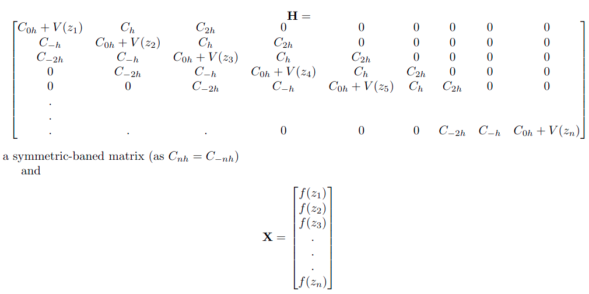

#Solution of the time dependent Schrödinger equation for a 1-D simple harmonic oscillator problem
-------------------------------------------------------------------------------------------------

The program solves the Schrödinger equation and determines the eigenvalues and eigenvectors for a 1-D simple harmonic oscillator (SHO) problem. The time-independent and time-dependent formalisms are provided. The general description of the project is given below.

---

For a one-dimensional system:

$$
H = KE + VE = -\frac{\hbar^2}{2m} \frac{\partial^2}{\partial x^2} + V(x)
$$

The one-dimensional **SHO** provides a simplistic model to demonstrate molecular vibrations. The importance of the harmonic oscillator problem stems from the fact that whenever there is a local potential minimum, the harmonic oscillator model gives the first approximation to the physics. The Taylor series expansion of the potential $(V(x))$ around the minimum at $x = x_0$ is:

$$
V(x) = V(x_0) + V'(x - x_0) + \frac{1}{2}V''(x - x_0)^2 + \dots
$$

$$
\Rightarrow V(x) - V(x_0) \approx \dfrac{1}{2}k(x-x_0)^2
$$

Subtracting the constant background potential $V(x_0)$ and assuming $X_0$ at origin,

$$
V(x) \approx \frac{1}{2} m \omega^2 x^2
$$

The form of the Hamiltonian then becomes:

$$
H = -\frac{\hbar^2}{2m} \frac{\partial^2}{\partial x^2} + \frac{1}{2} m \omega^2 x^2
$$

Introduce a **dimensionless variable**:

$$
z = x \sqrt{\frac{m \omega}{\hbar}}, \quad \text{so that} \quad \frac{\partial^2}{\partial x^2} = \frac{m \omega}{\hbar} \frac{\partial^2}{\partial z^2}
$$

Then the Hamiltonian becomes:

$$
H = \frac{\hbar \omega}{2} \left( -\frac{\partial^2}{\partial z^2} + z^2 \right)
$$

---

## The Eigenvalue Problem

The Schrödinger equation becomes:

$$
\frac{1}{2} \left( -\frac{\partial^2}{\partial z^2} + z^2 \right) \Psi = \frac{E}{\hbar \omega} \Psi
$$

The **energy eigenvalues** are expressed in **units of $\hbar\omega$**.

---

## Solving the eigenvalue problem
In order to find the first few eigenvalues and eigenvectors, the space is spanned in a limited, bounded region from $z_{min}$ to $z_{max}$, with a linear grid. Outside the boundary, the wave function is considered zero ($\approx$ harmonic oscillator in a potential well). The kinetic energy term in the form of the second-order derivative is discretized with a five-point formula (finite difference approach) as:

$f^{''}(z) = C_{-2h}f(z-2h) - C_{-h}f(z-h) + C_{0h}f(z) + C_hf(z+h) + C_{2h}f(z+2h) + O(h^4)$

$f^{''}(z) = -\dfrac{1}{12h^2}[f(z-2h) -16 f(z-h) +30 f(z) -16 f(z+h) + f(z+2h)] + O(h^4)$

So, the matrix eigen equation can be set up as: **HX** = **EX**, where

